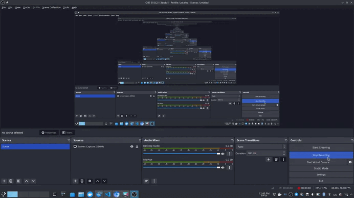

# Local Chess

<p align="center">
A two-player chess game for one laptop, built with TypeScript, Express, pnpm, and a custom animated browser UI.
</p>

<p align="center">
  
  
  
  
</p>

<p align="center">
  
</p>

---

## Overview

Local Chess is a small full-stack chess project designed for face-to-face play on a single machine.

It combines:

- a custom browser interface
- animated movement, captures, and win states
- automatic board rotation after each move
- a lightweight in-memory game server
- documented REST endpoints with Swagger / OpenAPI

The result is a project that feels playful in the browser while still being structured like a real API-backed app.

## Highlights

| Area | What it includes |
| --- | --- |
| Gameplay | Standard starting position, legal moves, captures, check, checkmate, stalemate |
| Visuals | Animated piece movement, capture effects, victory overlay, rotating board, styled 3D-looking pieces |
| API | `GET /api/game`, `POST /api/click`, `POST /api/reset` |
| Docs | Swagger UI and raw OpenAPI JSON |

## Animated Experience

The UI is intentionally more expressive than a basic chess board.

Included visual touches:

- smooth piece travel between squares
- capture collapse animation
- animated win overlay with restart action
- rotating board so each player sees their own side after every turn
- layered 3D-style chess pieces instead of flat symbols
- moving background and stylized red / black / orange theme

## Features

- Standard initial chess setup
- Turn-based play for White and Black
- Legal move highlighting
- Piece captures
- Check detection
- Checkmate detection
- Stalemate detection
- Automatic pawn promotion to queen
- Victory screen with restart button
- Swagger documentation for the API

## Current Limitations

The game is playable, but a few chess rules are still not implemented:

- castling
- en passant
- choosing a promotion piece other than queen

## Tech Stack

- TypeScript
- Node.js
- pnpm
- Express
- Plain HTML, CSS, and JavaScript
- OpenAPI / Swagger

## Quick Start

### Install dependencies

```bash
pnpm install
```

### Start the project

```bash
pnpm start
```

This command:

1. compiles TypeScript into `dist/`
2. starts the Express server

Default app URL:

```text
http://localhost:3456
```

Custom port example:

```bash
PORT=4000 pnpm start
```

## API

The current match state is stored in memory on the server.

### Endpoints

#### `GET /api/game`

Returns the full current game state.

#### `POST /api/click`

Handles a board click. Depending on the square, it either:

- selects a piece
- changes the current selection
- performs a move

Request body example:

```json
{
  "x": 5,
  "y": 2
}
```

#### `POST /api/reset`

Resets the current match back to the initial position.

## Swagger / OpenAPI

Interactive Swagger UI:

```text
http://localhost:3456/api/docs
```

Raw OpenAPI document:

```text
http://localhost:3456/api/openapi.json
```

## Project Structure

```text
src/
  game.ts        Game state, rules, and move handling
  main.ts        Express server and API routes
  openapi.ts     OpenAPI spec and Swagger HTML
  phigures.ts    Piece models and movement logic

public/
  index.html     Frontend UI, styles, animations, and client logic

docs/
  media/         README visuals and repository media

dist/
  ...            Compiled TypeScript output
```

## Development Notes

- The game state is in memory, so restarting the server resets the current match.
- The frontend communicates with the backend only through the local REST API.
- The UI and the API are intentionally simple, which makes the project easy to extend.

## Ideas For Next Steps

- add castling
- add en passant
- allow promotion choice
- persist games between restarts
- add move history / notation
- support multiplayer beyond a shared laptop

## Scripts

- `pnpm start` — compile and run the server

## License

ISC
